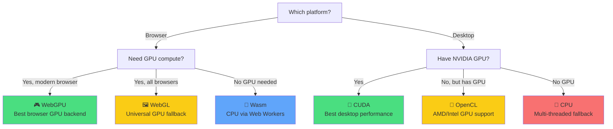

# SpawnDev.ILGPU Backend Audit — Browser vs Desktop

> Audit date: 2026-03-02 • Source: [README.md](file:///d:/users/tj/Projects/SpawnDev.ILGPU/SpawnDev.ILGPU/README.md), [Docs/](file:///d:/users/tj/Projects/SpawnDev.ILGPU/SpawnDev.ILGPU/Docs)

## Executive Summary

SpawnDev.ILGPU adds **three browser backends** (WebGPU, WebGL, Wasm) to ILGPU's original **three desktop backends** (CUDA, OpenCL, CPU). The same C# kernel code runs on all six without modification. Key findings:

| | WebGPU | WebGL | Wasm | CUDA | OpenCL | CPU |
|---|:---:|:---:|:---:|:---:|:---:|:---:|
| **Feature Parity** | 🟢 Full | 🟡 Limited | 🟢 Full | 🟢 Full | 🟢 Full | 🟢 Full |
| **Math Intrinsics** | ✅ 44/44 | ✅ 41/44 | ✅ 44/44 | ✅ 44/44 | ✅ 44/44 | ✅ 44/44 |
| **Atomics** | ✅ Full | ❌ Stubs | ✅ Full | ✅ Full | ✅ Full | ✅ Full |
| **Shared Memory** | ✅ | ❌ | ✅ | ✅ | ✅ | ✅ |
| **64-bit** | ✅ Emulated | ✅ Emulated | ✅ Native | ✅ Native | ✅ Native | ✅ Native |
| **Algorithms** | ✅ | ❌ | ✅ | ✅ | ✅ | ✅ |

**Verdict:** WebGPU and Wasm achieve **full feature parity** with desktop backends. WebGL is intentionally limited by GLSL ES 3.0 constraints — it trades features for universal browser coverage.

---

## 1. Architecture Comparison

### Compilation Pipeline

| Backend | C# IL → … | Output | Runs On |
|---------|-----------|--------|---------|
| **CUDA** | IL → ILGPU IR → PTX | NVIDIA PTX assembly | NVIDIA GPU |
| **OpenCL** | IL → ILGPU IR → OpenCL C | OpenCL C source | Any GPU w/ driver |
| **CPU** | IL → ILGPU IR → interpreted | — | CPU threads |
| **WebGPU** | IL → ILGPU IR → WGSL | WGSL shader | GPU (compute shader) |
| **WebGL** | IL → ILGPU IR → GLSL ES 3.0 | GLSL vertex shader | GPU (Transform Feedback) |
| **Wasm** | IL → ILGPU IR → Wasm binary | `.wasm` module | Web Workers (CPU) |

### Parallelism Model

| Backend | Dispatch Model | Workgroups | Barriers |
|---------|---------------|:----------:|:--------:|
| CUDA | GPU kernel launch (threads/blocks) | ✅ | ✅ |
| OpenCL | `clEnqueueNDRangeKernel` | ✅ | ✅ |
| CPU | `Parallel.For` / multi-threaded | ✅ | ✅ |
| WebGPU | `dispatchWorkgroups()` compute | ✅ | ✅ |
| WebGL | Draw call + Transform Feedback | ❌ no workgroups | ❌ |
| Wasm | Web Workers + SharedArrayBuffer | ✅ | ✅ |

---

## 2. Feature Parity Matrix

### Core Features

| Feature | CUDA | OpenCL | CPU | WebGPU | WebGL | Wasm |
|---------|:----:|:------:|:---:|:------:|:-----:|:----:|
| Basic kernels | ✅ | ✅ | ✅ | ✅ | ✅ | ✅ |
| Index1D/2D/3D | ✅ | ✅ | ✅ | ✅ | ✅ | ✅ |
| Scalar params | ✅ | ✅ | ✅ | ✅ | ✅ | ✅ |
| Struct params | ✅ | ✅ | ✅ | ✅ | ✅ | ✅ |
| ArrayView1D/2D | ✅ | ✅ | ✅ | ✅ | ✅ | ✅ |
| Control flow | ✅ | ✅ | ✅ | ✅ | ✅ | ✅ |
| Shared memory (static) | ✅ | ✅ | ✅ | ✅ | ❌ | ✅ |
| Shared memory (dynamic) | ✅ | ✅ | ✅ | ✅ | ❌ | ✅ |
| `Group.Barrier()` | ✅ | ✅ | ✅ | ✅ | ❌ | ✅ |
| `Group.Broadcast` | ✅ | ✅¹ | ✅ | ✅ | ❌ | ✅ |
| Warp/subgroup ops | ✅ | ✅¹ | ✅ | ✅² | ❌ | ❌ |
| Atomics (int) | ✅ | ✅ | ✅ | ✅ | ❌ | ✅ |
| Atomics (float via CAS) | ✅ | ✅ | ✅ | ✅ | ❌ | ✅ |
| AtomicCAS | ✅ | ✅ | ✅ | ✅ | ❌ | ✅ |
| GpuMatrix4x4 | ✅ | ✅ | ✅ | ✅ | ✅ | ✅ |

¹ Requires device subgroup support (dynamically detected)
² Requires `subgroups` WebGPU extension (Chrome 128+)

### ILGPU Algorithms (`ILGPU.Algorithms`)

| Algorithm | CUDA | OpenCL | CPU | WebGPU | WebGL | Wasm |
|-----------|:----:|:------:|:---:|:------:|:-----:|:----:|
| Reduce (Group/Warp) | ✅ | ✅ | ✅ | ✅ | ❌ | ✅ |
| Scan (Inclusive/Exclusive) | ✅ | ✅ | ✅ | ✅ | ❌ | ✅ |
| RadixSort | ✅ | ✅ | ✅ | ✅ | ❌ | ✅ |
| Histogram | ✅ | ✅ | ✅ | ✅ | ❌ | ✅ |
| Initialize/Transform | ✅ | ✅ | ✅ | ✅ | ✅ | ✅ |

> [!NOTE]
> WebGL lacks algorithms that depend on shared memory, barriers, or atomics — an architectural limitation of GLSL ES 3.0 vertex shaders.

---

## 3. Math Intrinsic Parity

### Unary (27 members)

All 27 `UnaryArithmeticKind` members are implemented across all backends:

- **Full parity (all 6 backends):** Neg, Not, Abs, RcpF, IsNaNF, IsInfF, IsFinF, SqrtF, RsqrtF, SinF, CosF, TanF, AsinF, AcosF, AtanF, SinhF, CoshF, TanhF, ExpF, Exp2F, FloorF, CeilingF, LogF, Log2F, Log10F
- **Functional but TF-limited on WebGL:** PopC, CLZ, CTZ — codegen emits correct GLSL (`bitCount`, `findMSB`, `findLSB`) but Transform Feedback may return incorrect values at runtime

### Binary (16 members) — All backends 16/16 ✅

Add, Sub, Mul, Div, Rem, And, Or, Xor, Shl, Shr, Min, Max, Atan2F, PowF, BinaryLogF, CopySignF

### Ternary (1 member) — All backends ✅

MultiplyAdd / FMA

### Math/MathF Redirects

All three browser backends register throw-free replacements for .NET methods that contain internal `throw` statements:

| Method | Auto-redirected? | Technique |
|--------|:----------------:|-----------|
| `Math.Clamp` | ✅ All | `Min(Max(val, min), max)` |
| `Math.Round` | ✅ All | Throw-free wrapper |
| `Math.Truncate` | ✅ All | Throw-free wrapper |
| `Math.Sign` | ✅ All | Throw-free wrapper |
| `MathF.FusedMultiplyAdd` | ✅ All | Throw-free wrapper |
| `XMath.Rsqrt` / `Rcp` | ✅ All | Throw-free wrapper |

> Desktop backends don't need these redirects because they can handle `throw` in IL.

---

## 4. 64-bit Type Support

| Type | CUDA | OpenCL | CPU | WebGPU | WebGL | Wasm |
|------|:----:|:------:|:---:|:------:|:-----:|:----:|
| `double` (f64) | ✅ Native | ✅ Native | ✅ Native | ✅ Emulated | ✅ Emulated | ✅ Native |
| `long` (i64) | ✅ Native | ✅ Native | ✅ Native | ✅ Emulated | ✅ Emulated | ✅ Native |

### Emulation Schemes (WebGPU & WebGL only)

| Scheme | Representation | Precision | Performance |
|--------|---------------|-----------|-------------|
| **Dekker** (default) | `vec2<f32>` | ~48–53 bit mantissa | ⚡ Fast |
| **Ozaki** (opt-in) | `vec4<f32>` | IEEE 754 compliant | 🐢 ~2× slower |
| **i64** | `vec2<u32>` | Exact | Moderate overhead |

> Wasm and desktop backends use native 64-bit — no emulation overhead.

---

## 5. Async API & Synchronization

| | Desktop (CUDA/OpenCL/CPU) | Browser (WebGPU/WebGL/Wasm) |
|---|---|---|
| `Synchronize()` | ✅ Blocking wait | ✅ Flush only (non-blocking) |
| `SynchronizeAsync()` | ✅ Falls back to sync | ✅ True async wait |
| `CopyToHostAsync()` | ✅ Falls back to sync | ✅ True async readback |
| `GetAsArray1D()` | ✅ Works | ❌ **Deadlocks** |
| `task.Result` / `.Wait()` | ✅ Works | ❌ **Deadlocks** |

> [!CAUTION]
> The async API (`SynchronizeAsync`, `CopyToHostAsync`) is the **only safe cross-platform pattern**. Synchronous APIs work on desktop but deadlock in Blazor WASM's single-threaded environment.

---

## 6. Unique Browser Backend Capabilities

Features that desktop backends **don't have**, only available in browser backends:

| Feature | Backend | Description |
|---------|---------|-------------|
| `CopyToHostUint8ArrayAsync` | WebGPU, WebGL, Wasm | Returns JS `Uint8Array` for direct Canvas/WebGL texture use |
| `IBrowserMemoryBuffer` | All browser | Zero-copy GPU→Canvas rendering pipeline |
| `ExternalWebGPUMemoryBuffer` | WebGPU | Wrap external `GPUBuffer` (ONNX RT, Three.js interop) |
| `CreateFromExternalDevice` | WebGPU | Share `GPUDevice` with other WebGPU libraries |
| Multi-worker dispatch | Wasm | Distributes across Web Workers via `SharedArrayBuffer` |
| WebGPU extension auto-detection | WebGPU | Probes `shader-f16`, `subgroups`, `timestamp-query` |
| Off-main-thread GL | WebGL | All GL calls run in a Web Worker via `glWorker.js` |

---

## 7. Limitations & Gaps

### WebGL-Specific Gaps (Architectural — Cannot Be Fixed)

| Missing Feature | Why | Impact |
|-----------------|-----|--------|
| Shared memory | GLSL ES 3.0 vertex shaders have no `shared` qualifier | No workgroup communication |
| Barriers | No `barrier()` in vertex stage | No workgroup sync |
| Atomics | No atomic ops in vertex stage | No thread-safe writes |
| Subgroup/warp ops | Not exposed in vertex stage | No warp shuffles |
| ILGPU Algorithms | Most require shared mem / atomics | Reduce, Scan, Sort unavailable |
| PopC/CLZ/CTZ accuracy | TF readback may return wrong values | Codegen is correct, runtime behavior limited |

### Wasm-Specific Gaps

| Gap | Impact | Workaround |
|-----|--------|------------|
| No GPU execution | Runs on CPU cores | Use WebGPU for GPU compute |
| Requires `SharedArrayBuffer` for multi-worker | Needs COOP/COEP headers | `coi-serviceworker.js` included in demo |
| No warp/subgroup ops | No `Warp.Shuffle` | Use shared memory + barriers instead |

### All Browser Backends

| Constraint | Description |
|------------|-------------|
| No `throw` in kernels | IL `throw` instruction not supported — auto-redirects handle common cases |
| No reference types | Only value types (structs, primitives) in kernels |
| No recursion | GPU hardware limitation shared with desktop |
| No IL trimming or AOT | ILGPU needs IL reflection at runtime |
| ~19 param max | Same ILGPU limitation as desktop — pack into structs |

---

## 8. Upstream ILGPU Fixes (v3.3.0)

The SpawnDev fork has fixed **6 upstream ILGPU bugs** that benefit all backends:

| Fix | Issue | Severity | Backends Affected |
|-----|-------|----------|-------------------|
| `CopySign` arg order | [#1361](https://github.com/m4rs-mt/ILGPU/issues/1361) | High | All GPU |
| `uint→float` via double | [#1309](https://github.com/m4rs-mt/ILGPU/issues/1309) | Medium | OpenCL (Intel iGPU) |
| Large local array unrolling | [#1479](https://github.com/m4rs-mt/ILGPU/issues/1479) | High | All |
| Nested struct ICE | [#1538](https://github.com/m4rs-mt/ILGPU/issues/1538) | Medium | All |
| H100/H200 support | [#1540](https://github.com/m4rs-mt/ILGPU/issues/1540) | High | CUDA (SM_90+) |
| OpenCL phi variable bug | [#1539](https://github.com/m4rs-mt/ILGPU/issues/1539) | High | OpenCL |

---

## 9. Test Coverage

**640 tests** across 8 suites:

| Suite | Backend | Tests |
|-------|---------|:-----:|
| WebGPUTests | WebGPU | ~128 |
| WebGLTests | WebGL | ~80 |
| WasmTests | Wasm | ~128 |
| CPUTests | CPU (browser) | ~48 |
| DefaultTests | Auto-select | ~16 |
| CudaTests | CUDA | ~128 |
| OpenCLTests | OpenCL | ~128 |
| DesktopCPUTests | CPU (desktop) | ~128 |

Coverage areas: Memory, Indexing, Arithmetic, Bitwise, Math, Atomics, Control Flow, Structs, Type Casting, 64-bit Emulation, GPU Patterns, Shared Memory, Broadcast/Subgroups, Dynamic Shared Memory, Special Values, Backend Selection, GpuMatrix4x4.

---

## 10. Backend Selection Guide

**Auto-selection:** Use `CreatePreferredAcceleratorAsync()` — it follows WebGPU → WebGL → Wasm (browser) or CUDA → OpenCL → CPU (desktop).
